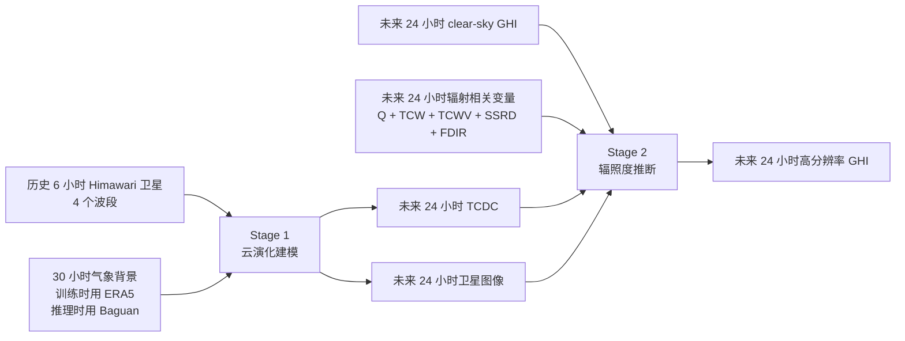
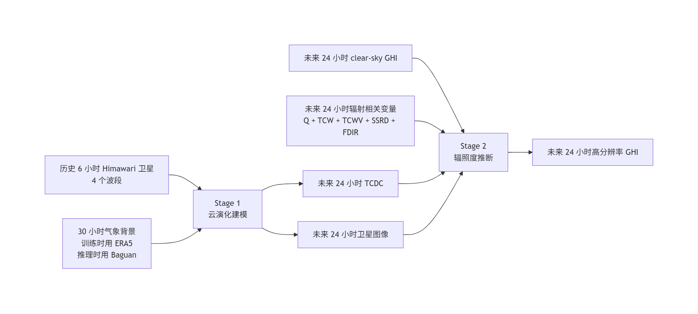
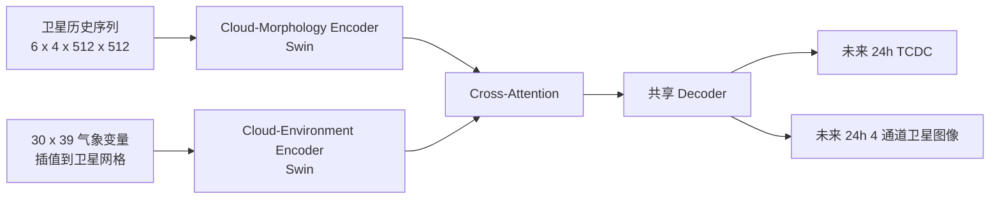
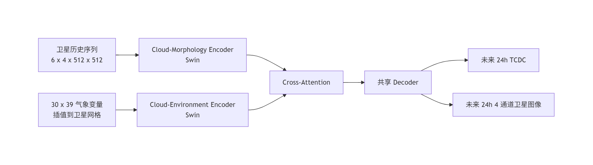
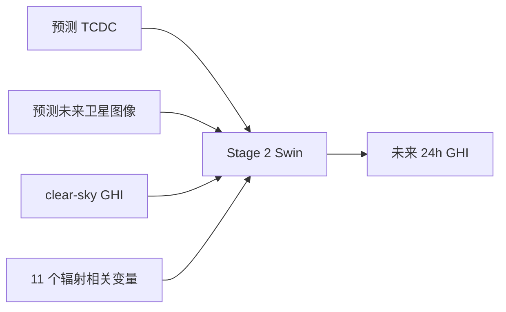
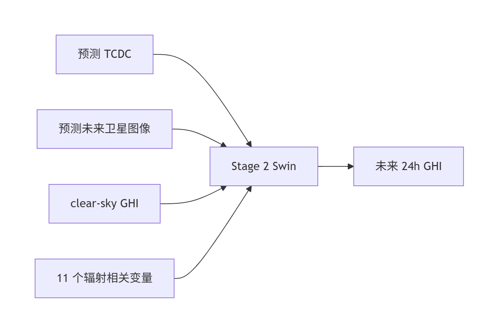
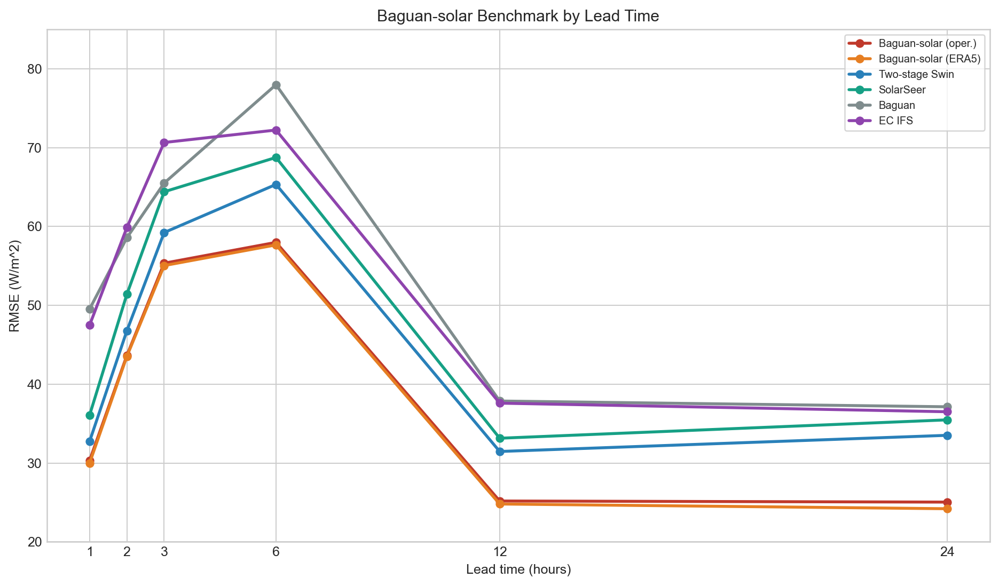
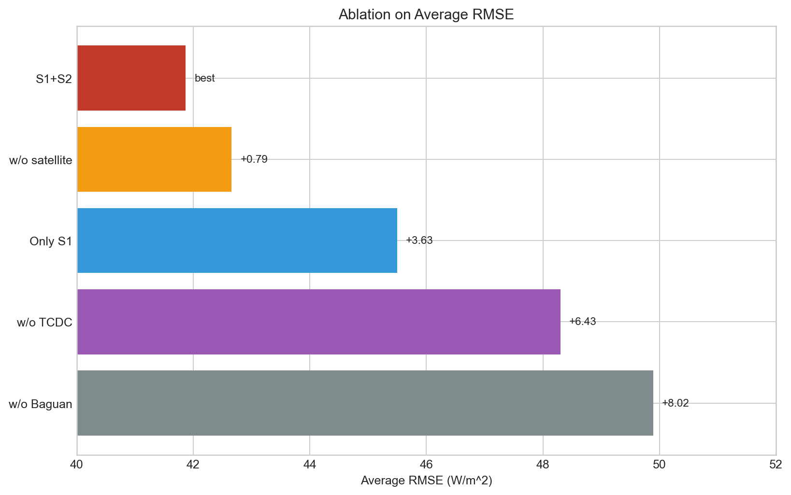

# Baguan-solar 论文中文解读

> 论文标题：`Integrating Weather Foundation Model and Satellite to Enable Fine-Grained Solar Irradiance Forecasting`  
> arXiv：`2603.14845v2`  
> 代码仓库：<https://github.com/DAMO-DI-ML/Baguan-solar>

## 1. 先给结论

这篇论文要解决的不是一般意义上的“天气预测”，而是一个更具体、也更难的任务：

- 在 `24 小时` 预测时效下，
- 做 `0.05° / 512 x 512` 的高分辨率太阳辐照度 `GHI` 预测，
- 既要保留云系的细粒度空间结构，
- 又不能像纯卫星外推那样在长时效上快速失真。

论文的核心思想可以浓缩成一句话：

**不要直接预测 GHI，而是先预测“云及其形态演化”，再结合 clear-sky 物理先验和大尺度气象背景推断 GHI。**

这也是 Baguan-solar 最关键的设计价值：

- 用卫星保留细节；
- 用 WFM/ERA5 提供大尺度动力约束；
- 用两阶段解耦处理日夜切换和云辐射关系。

## 2. 一图看懂论文

从这个图里可以看出，Baguan-solar 的本质不是“多模态拼接”，而是：

1. 先解决云怎么演化。
2. 再解决云如何映射到地表辐照度。

## 3. 为什么这个问题难

| 难点 | 具体表现 | 传统方案的问题 | 论文的对应思路 |
| --- | --- | --- | --- |
| 日夜不连续 | 夜间 GHI 严格为 0，日出日落附近跳变强 | 直接回归 GHI 容易在过渡时刻不稳定 | 先预测云，再用 clear-sky GHI 做物理约束 |
| 细尺度云结构 | 小尺度云边界会造成 GHI 剧烈空间波动 | 粗分辨率 NWP/WFM 看不清局地云形态 | 用 Himawari 卫星保留云纹理与边界 |
| 长时效演化 | 12-24 h 后云的形成、消散不再是简单平移 | 纯卫星外推会积累误差 | 用 Baguan/ERA5 提供热力和动力背景 |
| 高分辨率与可运营兼顾 | 既要细，又要快，还要能实际部署 | 全局高分辨率物理模式成本太高 | 采用“两阶段 + WFM + 卫星”的折中架构 |

论文的核心洞见是：

**GHI 本身不是一个最适合直接建模的中间表示。**

云量和卫星云图在昼夜都连续存在，先预测它们更稳定；之后再用 clear-sky GHI 作为物理上界去约束 GHI，问题就被“拆小”了。

## 4. 论文整体定位

可以把文中对比对象分成 4 类：

| 类别 | 代表 | 优点 | 短板 |
| --- | --- | --- | --- |
| 数值天气预报 | EC IFS | 物理一致性强，长时效稳 | 计算昂贵，局地云细节不够 |
| 天气基础模型 | Baguan | 大尺度预测强，速度快 | 原生分辨率粗，不擅长细粒度辐照度 |
| 卫星外推模型 | SolarSeer | 空间细节丰富，短时效强 | 长时效易退化 |
| 本文方法 | Baguan-solar | 细节与长时效兼顾 | 训练与部署链条更复杂 |

所以这篇论文真正填补的是一个“中间空白”：

- NWP/WFM 有大尺度约束，但分辨率不够；
- 卫星外推分辨率够，但动力约束不够；
- Baguan-solar 试图把两者补起来。

## 5. 数据、标签与任务定义

### 5.1 数据源总览

| 数据源 | 分辨率 | 区域 | 变量 | 在论文中的角色 |
| --- | --- | --- | --- | --- |
| Himawari-8/9 | `0.05°` | 亚太 | `B03/B07/B10/B14` | 训练和推理输入，提供云形态 |
| CLDAS | `0.05°` | 东亚 | `SSRD -> GHI`, `TCDC` | 训练标签与评估真值 |
| ERA5 | `0.25°` | 全球 | `U/V/T/Q/Z/TCC/SSRD/...` | 训练阶段的气象背景 |
| Baguan forecast | `0.25°` | 全球 | 与 ERA5 对齐的预测变量 | 推理阶段的运营输入 |

### 5.2 为什么用 CLDAS 做真值

论文明确表达了一个重要判断：

- ERA5 可以作为气象背景；
- 但在东亚区域的地表辐照度上，CLDAS 比 ERA5 更接近真实观测。

在部署验证部分，论文给出站点级比较：

| 对比对象 | 插值到站点后的 RMSE |
| --- | --- |
| ERA5 | `77.85` |
| CLDAS | `66.69` |

这说明作者不是把“再分析场”直接当成地表辐照度真值，而是有意识地选择了更贴近区域地面观测融合产物的 CLDAS。

### 5.3 论文实际任务切分

| 阶段 | 输入 | 输出 | 本质任务 |
| --- | --- | --- | --- |
| Stage 1 | 6h 卫星历史 + 30h 气象背景 | 24h `TCDC + 未来卫星图像` | 云及其形态演化建模 |
| Stage 2 | Stage 1 输出 + clear-sky GHI + 辐射相关变量 | 24h `GHI` | 云到辐照度的物理映射 |

### 5.4 论文选用的 4 个卫星波段

| 波段 | 中心波长 | 论文强调的作用 |
| --- | --- | --- |
| `B03` | `0.64 μm` | 白天云量与场景细节 |
| `B07` | `3.9 μm` | 夜雾/低云、热点、云顶温度支持 |
| `B10` | `7.3 μm` | 低层水汽、干侵入、对流环境 |
| `B14` | `11.2 μm` | 红外窗口，云顶和微物理信息 |

这四个波段的组合本质上兼顾了：

- 可见光云纹理；
- 夜间低云信息；
- 水汽结构；
- 红外云顶信息。

## 6. 方法详解

### 6.1 Stage 1：先学“云怎么走、怎么长、怎么散”

论文的 Stage 1 输入不是单一模态，而是两条分支：

- 卫星分支：看局地云形态；
- 气象分支：看大尺度背景环境。

#### 论文里的关键设计

| 组件 | 作用 | 直观理解 |
| --- | --- | --- |
| 卫星编码器 | 抽取细粒度云纹理与边界 | 保住“云长什么样” |
| 环境编码器 | 抽取动力和热力背景 | 告诉模型“云为什么会这样变” |
| Cross-Attention | 用环境信息调制卫星表示 | 让卫星不只是外推，而是受天气背景约束 |
| 共享 Decoder | 同时输出 `TCDC + 卫星未来` | 用多任务约束强化云表示 |

#### Stage 1 在论文中的真正意义

Stage 1 不是一个可有可无的辅助头，而是整篇论文的支点：

- 如果没有 Stage 1，模型会退化成“直接从输入回归 GHI”；
- 这样会把云形态建模、日夜切换、辐射映射全揉在一起；
- 难度更高，也更不稳定。

### 6.2 Stage 2：从“云”到“辐照度”

Stage 2 的逻辑是：

- 云量和未来卫星图像给出“遮挡发生了什么”；
- clear-sky GHI 给出“在无云情况下理论上能有多少辐照度”；
- 辐射相关气象变量给出“环境是否支持这种辐照度水平”。

论文描述的 Stage 2 输入包括：

- `1` 个预测云量通道；
- `4` 个预测卫星通道；
- `1` 个 clear-sky GHI；
- `11` 个辐射相关气象变量。

合计 `17` 通道。

### 6.3 论文与公开代码的一个细节差异

公开 repo 里，Stage 2 代码实际还额外拼接了一个 `lead_time` 通道，因此代码实现是 `18` 通道输入，而不是附录中写的 `17` 通道。这个差异值得记住：

| 项目 | 论文描述 | 公开代码 |
| --- | --- | --- |
| Stage 2 输入通道数 | `17` | `18` |
| 差异来源 | 无 | 额外加入 `lead_time` |

这更像是公开实现中的一个增强项，而不一定是论文主文的核心创新。

### 6.4 Stage 2 里到底用了哪 11 个气象变量

结合附录和公开代码，可以把 Stage 2 的 `11` 个气象通道写清楚：

| 类别 | 变量 |
| --- | --- |
| 比湿 | `Q` 在 `7` 个气压层 |
| 整层辐射/水汽 | `TCW`, `TCWV`, `SSRD`, `FDIR` |

所以是：

- `Q @ 7 levels`
- `TCW`
- `TCWV`
- `SSRD`
- `FDIR`

共 `7 + 4 = 11` 个变量。

### 6.5 clear-sky GHI 为什么是这篇论文里的关键“物理先验”

论文没有把 clear-sky GHI 当作普通特征，而是把它放在一个非常关键的位置：

- 它给出了理论上的辐照度上界；
- 它天然编码了太阳几何和昼夜信息；
- 它使得 GHI 预测更接近“云对理想辐照度的调制”。

论文还做了一个非常工程化但很重要的优化：

| 方案 | 512 x 512 网格每个时刻耗时 |
| --- | --- |
| 原始 `pvlib` 逐点计算 | 约 `4 分钟` |
| 论文中的向量化实现 | 约 `1 秒` |

也就是说，clear-sky GHI 的计算被加速到了大约 `240x`。

这件事很重要，因为它让 clear-sky 先验不仅能在离线实验里用，也能在真实部署里用。

### 6.6 训练目标

论文使用加权多任务损失：

`L = λ_sat L_sat + λ_tcdc L_tcdc + λ_ghi L_ghi`

文中给出的权重是：

| 损失项 | 权重 |
| --- | --- |
| 卫星预测损失 | `1.0` |
| TCDC 损失 | `0.5` |
| GHI 损失 | `1.0` |

这意味着作者并不是只关心最终 GHI，而是明确要求 Stage 1 的中间变量必须学得靠谱。

## 7. 关键张量与维度梳理

下面这个表对理解代码实现特别有用。

| 名称 | 论文含义 | 典型形状 |
| --- | --- | --- |
| 卫星历史输入 | 6 小时、4 波段 Himawari | `6 x 4 x 512 x 512` |
| 气象背景输入 | 30 小时、39 变量 | `30 x 39 x 103 x 103`，再插值到 `512 x 512` |
| Stage 1 输出云量 | 未来 24h TCDC | `24 x 1 x 512 x 512` |
| Stage 1 输出卫星 | 未来 24h、4 波段卫星图像 | `24 x 4 x 512 x 512` |
| clear-sky GHI | 未来 24h 物理先验 | `24 x 1 x 512 x 512` |
| Stage 2 输出 | 未来 24h GHI | `24 x 1 x 512 x 512` |

## 8. 模态贡献随 lead time 的变化

论文用 Integrated Gradients 做了一个很有解释力的分析：

- 短时效时，卫星贡献明显；
- 长时效时，ERA5/Baguan 贡献越来越大。

可以把它理解成下面这条时间轴：

论文给出的结论是：

- 卫星对短时效 `1-3 h` 的 RMSE 改善最显著；
- 到 `24 h` 时，ERA5/Baguan 的贡献已经压倒性更强；
- 这正是“卫星负责细节，WFM 负责长时效约束”的证据。

## 9. 主实验结果怎么读

### 9.1 Lead time 曲线图

下图根据论文 Table 2 的数据整理，展示不同模型在关键 lead time 上的 RMSE。

### 9.2 主结果表

| 模型 | 输入 | Avg. | 1h | 2h | 3h | 6h | 12h | 24h |
| --- | --- | ---: | ---: | ---: | ---: | ---: | ---: | ---: |
| Mean | None | 83.89 | - | - | - | - | - | - |
| Clear-sky | None | 113.54 | - | - | - | - | - | - |
| Baguan | Gridded initial field | 58.17 | 49.53 | 58.57 | 65.50 | 77.98 | 37.86 | 37.13 |
| EC IFS | Gridded initial field | 54.46 | 47.48 | 59.86 | 70.65 | 72.23 | 37.59 | 36.50 |
| SolarSeer | Satellite | 53.09 | 36.07 | 51.40 | 64.40 | 68.75 | 33.14 | 35.47 |
| Two-stage Unet | Satellite | 59.10 | 47.03 | 60.32 | 72.15 | 74.79 | 39.10 | 41.78 |
| Two-stage Swin | Satellite | 49.89 | 32.74 | 46.77 | 59.23 | 65.33 | 31.46 | 33.51 |
| Baguan-solar | ERA5 + Satellite | 41.21 | 29.99 | 43.52 | 55.04 | 57.66 | 24.80 | 24.20 |
| Baguan-solar (oper.) | Baguan + Satellite | 41.87 | 30.31 | 43.64 | 55.34 | 57.98 | 25.18 | 25.04 |

### 9.3 应该重点读出的信息

| 观察 | 解释 |
| --- | --- |
| `Baguan-solar (oper.)` 平均 RMSE `41.87` 最优 | 多模态 + 两阶段设计有效 |
| 理想版 `ERA5 + Satellite` 只比运营版更好一点点 | Baguan 短时效预报已经足够接近真实背景 |
| `Two-stage Swin` 明显优于 `SolarSeer` | Swin 作为骨干比更简单外推结构更适合这个任务 |
| `SolarSeer` 随 lead time 增大退化明显 | 纯卫星外推长时效不稳 |
| `Baguan/EC IFS` 空间分辨率不够，整体不如高分辨率学习方法 | 粗网格直接限制了局地 GHI 表达能力 |

### 9.4 两个最重要的相对提升

| 对比对象 | 相对改进 |
| --- | ---: |
| 相比 `Two-stage Swin` | `16.08%` |
| 相比 `Baguan` | `28.02%` |

这两个数字其实对应两层含义：

- 对比 `Two-stage Swin`，说明论文不是只靠“把分辨率做高”，而是真正从多模态融合里获益；
- 对比 `Baguan`，说明论文也不是只靠“用更强 WFM”，而是确实把粗分辨率 Baguan 精炼成了细粒度太阳辐照度。

## 10. 消融实验怎么读

### 10.1 消融图

### 10.2 消融表

| 设置 | Avg. | 1h | 2h | 3h | 6h | 12h | 24h |
| --- | ---: | ---: | ---: | ---: | ---: | ---: | ---: |
| Baguan-solar (S1+S2) | 41.87 | 30.31 | 43.64 | 55.34 | 57.98 | 25.18 | 25.04 |
| w/o Baguan | 49.89 | 32.74 | 46.77 | 59.23 | 65.33 | 31.46 | 33.51 |
| w/o satellite | 42.66 | 37.35 | 49.54 | 59.36 | 59.03 | 25.05 | 24.60 |
| Baguan-solar (Only S1) | 45.50 | 32.34 | 44.86 | 56.38 | 59.73 | 35.86 | 28.92 |
| w/o TCDC | 48.30 | 35.21 | 47.30 | 58.37 | 61.87 | 41.00 | 32.62 |

### 10.3 这张表真正说明了什么

#### 去掉 Baguan

| 指标 | 变化 |
| --- | ---: |
| Avg. | `+19.15%` |
| 12h | `+24.94%` |
| 24h | `+33.83%` |

解释：

- 没有 Baguan/ERA5 的大尺度约束，模型在长时效上明显撑不住；
- 这说明纯卫星外推不能解决云生成和消散的问题。

#### 去掉卫星

| 指标 | 变化 |
| --- | ---: |
| Avg. | `+1.89%` |
| 1h | `+23.23%` |
| 2h | `+13.52%` |

解释：

- 平均影响不大，说明长时效主要还是靠气象背景；
- 但短时效劣化非常明显，说明卫星对局地边界和细纹理非常关键。

#### 只保留 Stage 1，不做 Stage 2 解耦

| 指标 | 变化 |
| --- | ---: |
| Avg. | `+8.67%` |

解释：

- 两阶段解耦不是“工程复杂化”，而是有明显收益；
- 它把“云演化”和“辐射映射”拆成了两个更自然的子问题。

#### 去掉 TCDC 监督

| 指标 | 变化 |
| --- | ---: |
| Avg. | `+15.36%` |

解释：

- TCDC 不是可有可无的辅助任务；
- 它给 Stage 1 提供了一个更明确、更物理的中间约束。

## 11. 论文中的“创新点”到底是什么

很多文章会说自己“多模态融合”，但真正有价值的创新点要更具体。这篇论文最值得记的有 4 个：

| 创新点 | 简述 | 为什么重要 |
| --- | --- | --- |
| 两阶段解耦 | 先预测云，再预测 GHI | 直接缓解日夜不连续和任务难度 |
| 卫星 + WFM 融合 | 卫星保细节，Baguan 保长时效 | 同时解决短时效与长时效矛盾 |
| clear-sky 物理先验 | 引入物理上界与昼夜结构 | 让模型更有物理含义 |
| 可运营化设计 | 训练用 ERA5，部署用 Baguan | 不是纯论文结构，而是面向上线 |

如果只看“模型结构”，容易把这篇论文低估成“一个双编码器 + Swin 的网络”。  
真正要看的是它的**任务拆分方式**和**多源信息组织方式**。

## 12. 部署部分透露出的实际价值

论文没有停在离线评测，而是给了部署信息：

| 项目 | 论文描述 |
| --- | --- |
| 上线时间 | `2025 年 7 月` 起 |
| 应用区域 | 中国东部某省 |
| 省级装机容量 | `918.4 GW` |
| Baguan 运行频率 | 每天 `4` 次：`UTC 00/06/12/18` |
| Baguan 推理成本 | 约 `0.5 h / 2 GPUs` |
| Baguan-solar 运行频率 | `每小时` 一次 |
| 站点验证 | `246` 个 pyranometer 站点 |

这里最值得注意的不是“上线了”，而是它展示了一个非常现实的系统分工：

- Baguan 给出较慢、较稳的大尺度背景；
- Himawari 持续给出高频观测；
- Baguan-solar 在二者之上做更高频率的高分辨率补充。

这是一种非常典型、也很实用的“粗到细”运营架构。

## 13. 公开 repo 与论文的对应关系

由于你当前看的 repo 就是论文代码 clone 下来的，所以理解论文时必须顺便理解代码现状。

### 13.1 可以确认对上的部分

| 项目 | 论文 | 公开 repo |
| --- | --- | --- |
| 6h 历史 + 24h 未来 | 是 | 是 |
| 4 个卫星波段 | 是 | 是 |
| Stage 1 使用 39 个气象通道 | 是 | 是 |
| Stage 2 使用 11 个辐射相关通道 | 是 | 是 |
| clear-sky GHI 向量化计算 | 是 | 是 |
| 训练用 ERA5、测试用 Baguan | 是 | 是 |

### 13.2 需要谨慎理解的部分

| 项目 | 公开 repo 现状 | 影响 |
| --- | --- | --- |
| 训练循环 | 每个 epoch 只跑一个 batch | 不能直接复现实验 |
| TCDC 权重 | 默认 `0.1` | 与论文写的 `0.5` 不一致 |
| Stage 2 输入 | 代码额外加入 `lead_time` | 与附录描述有偏差 |
| 起报时刻 | 数据集过滤只保留 `00/12 UTC` | 与论文图中 `00/06/12/18` 不完全一致 |
| 完整评测脚本 | 未公开全部 baseline/部署代码 | 不能完整复现论文所有表图 |

所以更准确的说法是：

**这个 repo 足够帮助你理解论文主方法，但还不是一套完整的 benchmark reproduction package。**

## 14. 对这篇论文的深入理解

### 14.1 这篇论文最重要的思维方式

它不是在问：

> 我怎样把更多数据喂给一个更大的网络？

而是在问：

> 对 GHI 这个任务，什么中间表示更容易学、也更符合物理？

作者给出的答案是：

- 先学云；
- 再由云推辐照度；
- 同时把 clear-sky 作为物理锚点。

这就是这篇论文最有启发性的地方。

### 14.2 为什么它比“单阶段直接预测 GHI”更合理

| 直接预测 GHI | 两阶段预测 |
| --- | --- |
| 把云演化、昼夜切换、辐射映射揉在一起 | 把问题拆成两个更自然的子问题 |
| 中间表示不明确 | 中间表示可解释：TCDC 和未来卫星图像 |
| 训练不稳定，物理意义弱 | 更稳定，也更容易做误差归因 |

### 14.3 为什么它不是单纯的“把 Baguan 上采样”

论文并不是简单做一个 super-resolution：

- 如果只是把 Baguan 上采样，高分辨率细节还是出不来；
- 如果只用卫星外推，长时效背景约束又不够；
- Baguan-solar 的重点在于：
  - 用卫星保证高频局地结构；
  - 用 Baguan/ERA5 保证长时效演化方向。

它本质上是一个**结构化融合问题**，而不是普通上采样问题。

## 15. 论文的局限与值得追问的点

这篇论文虽然很强，但也有几个值得进一步追问的地方：

| 问题 | 含义 |
| --- | --- |
| 区域泛化如何 | 当前主要是东亚，换区域后云系统计特征会变 |
| 多卫星全球扩展难度 | 全球部署需要跨卫星拼接、重标定与时空对齐 |
| 不确定性缺失 | 论文给的是点预测，没有系统性不确定性评估 |
| 上游 WFM 依赖 | 若 Baguan 背景本身偏差较大，下游仍会受影响 |
| 公开复现完整性不足 | public repo 还不是完整实验包 |

这些也正是论文最后提到的未来方向：

- 全球化；
- 不确定性建模；
- 与上游 WFM 更紧密的联合训练。

## 16. 你应该怎么使用这篇论文

如果你的目标是“真正吃透”，建议把它当成 3 篇论文来读：

| 视角 | 应该关注什么 |
| --- | --- |
| 任务设计论文 | 为什么先预测云、再预测 GHI |
| 多模态融合论文 | 卫星和 WFM 如何按时效分工 |
| 工程部署论文 | clear-sky 加速、训练/推理切换、小时级运营 |

如果你的目标是“后续复现/改进”，优先抓住 4 个抓手：

1. Stage 1 的中间监督是否还能更强。
2. Stage 2 是否可以做概率预测而不是点预测。
3. 多时效权重是否能自适应。
4. 上游 Baguan 与下游 GHI 是否能联合优化。

## 17. 最后用一句话总结

**Baguan-solar 的本质，不是把天气基础模型和卫星图像简单拼接，而是把高分辨率太阳辐照度预测重构成“云演化 + 物理辐射映射”两个子问题，再让卫星负责细节、让 WFM 负责长时效约束。**

---

## 附：相关文件

- 论文-代码审计笔记：[baguan_solar_paper_repo_audit.md](baguan_solar_paper_repo_audit.md)
- 主结果图：`notes/assets/baguan_solar_benchmark_leadtime.png`
- 消融图：`notes/assets/baguan_solar_ablation_avg.png`
